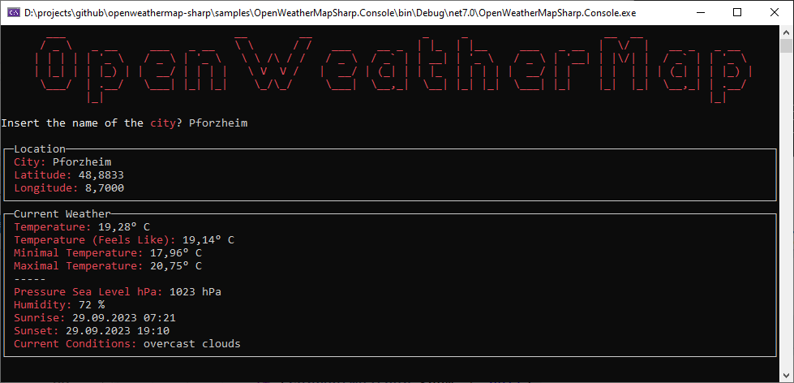

# OpenWeahterMapSharp

A .NET client wrapper for https://openweathermap.org written in .NET Standard 2.0


## Installation

Install the package via [NuGet](https://www.nuget.org/packages/OpenWeatherMapSharp).

<a href="https://www.nuget.org/packages/OpenWeatherMapSharp" target="_blank"></a>


## Usage

First you need to get a free API key from [openweathermap.org](https://www.openweathermap.org). You can create a new account and you will find your API keys [here](https://home.openweathermap.org/api_keys).

You need to create a new instance of `OpenWeatherMapService` passing in the *API key*. There is also an interface available, if you are using Dependency Injection.

```csharp
/// <summary>
///     Gets forecast for a location given its longitude and latitude
/// </summary>
Task<OpenWeatherMapServiceResponse<ForecastRoot>> GetForecastAsync(
    double latitude,
    double longitude,
    LanguageCode language = LanguageCode.EN,
    Unit unit = Unit.Standard);

/// <summary>
///     Gets forecast for a location given its city ID
/// </summary>
[Obsolete]
Task<OpenWeatherMapServiceResponse<ForecastRoot>> GetForecastAsync(
    int cityId,
    LanguageCode language = LanguageCode.EN,
    Unit unit = Unit.Standard);

/// <summary>
///     Gets forecast for a location given its city name
/// </summary>
[Obsolete]
Task<OpenWeatherMapServiceResponse<ForecastRoot>> GetForecastAsync(
    string city,
    LanguageCode language = LanguageCode.EN,
    Unit unit = Unit.Standard);

/// <summary>
///     Gets weather information for a location given its longitude and latitude
/// </summary>
Task<OpenWeatherMapServiceResponse<WeatherRoot>> GetWeatherAsync(
    double latitude,
    double longitude,
    LanguageCode language = LanguageCode.EN,
    Unit unit = Unit.Standard);

/// <summary>
/// Gets weather information for a location given its city ID
/// </summary>
[Obsolete]
Task<OpenWeatherMapServiceResponse<WeatherRoot>> GetWeatherAsync(
    int cityId,
    LanguageCode language = LanguageCode.EN,
    Unit unit = Unit.Standard);

/// <summary>
/// Gets weather information for a location given its city name
/// </summary>
[Obsolete]
Task<OpenWeatherMapServiceResponse<WeatherRoot>> GetWeatherAsync(
    string city,
    LanguageCode language = LanguageCode.EN,
    Unit unit = Unit.Standard);
```

***HINT:*** Some methods are marked as `obsolete`, because [openweathermap.org](https://openweathermap.org) marked these methods as depracted. Currently they are all still working, but might be removed in feature releases. They recommend using the methods with *latitude* and *longitude* to get the current weather or the forecast.


## Sample

Here is a screenshot of the `Console Application` using the [NuGet package](https://www.nuget.org/packages/OpenWeatherMapSharp) to get the current weather for a provided city.



## Buy Me A Coffee

I appreciate any form of support to keep my _Open Source_ activities going.

Whatever you decide, be it reading and sharing my blog posts, using my NuGet packages or buying me a coffee/book, thank you ❤️.

<a href="https://www.buymeacoffee.com/tsjdevapps" target="_blank"></a>

## Contributing

Pull requests are welcome. For major changes, please open an issue first
to discuss what you would like to change.

Please make sure to update tests as appropriate.

## License

[MIT](https://choosealicense.com/licenses/mit/)